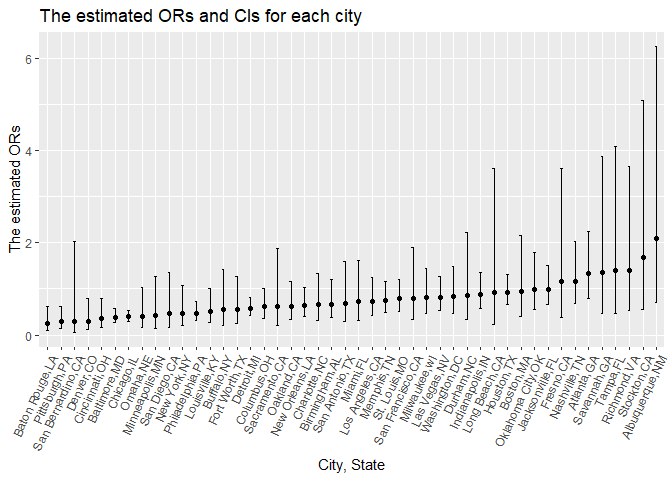

Homework 6
================
yh3429
2022-12-02

## Problem 2

``` r
library (tidyverse)
library(ggplot2)
```

##### Read raw data

``` r
raw_df = read_csv("./data/homicide-data.csv") 
```

    ## Rows: 52179 Columns: 12
    ## ── Column specification ────────────────────────────────────────────────────────
    ## Delimiter: ","
    ## chr (9): uid, victim_last, victim_first, victim_race, victim_age, victim_sex...
    ## dbl (3): reported_date, lat, lon
    ## 
    ## ℹ Use `spec()` to retrieve the full column specification for this data.
    ## ℹ Specify the column types or set `show_col_types = FALSE` to quiet this message.

There are 52,179 observations and 12 variables in the raw dataset. And
the key variables include `city`, `state`, `dispostion`, and so on.

##### Data cleaning

``` r
homicide_df = raw_df %>%
  janitor::clean_names() %>%
  filter (city != "Dallas" & city !="Phoenix"& 
          city != "Kansas City"& city !="Tulsa") %>%  
  filter (victim_race == c("White", "Black")) %>% 
  mutate (city_state = str_c (city, ",", state),
          resolved = as.numeric(disposition == "Closed by arrest"),     
          victim_age = as.numeric(victim_age))
```

    ## Warning in mask$eval_all_mutate(quo): NAs introduced by coercion

``` r
homicide_df
```

    ## # A tibble: 19,547 × 14
    ##    uid   repor…¹ victi…² victi…³ victi…⁴ victi…⁵ victi…⁶ city  state   lat   lon
    ##    <chr>   <dbl> <chr>   <chr>   <chr>     <dbl> <chr>   <chr> <chr> <dbl> <dbl>
    ##  1 Alb-…  2.01e7 SATTER… VIVIANA White        15 Female  Albu… NM     35.1 -107.
    ##  2 Alb-…  2.01e7 MULA    VIVIAN  White        72 Female  Albu… NM     35.1 -107.
    ##  3 Alb-…  2.01e7 MARTIN… GUSTAVO White        56 Male    Albu… NM     35.1 -107.
    ##  4 Alb-…  2.01e7 BRITO   ELIZAB… White        22 Female  Albu… NM     35.1 -107.
    ##  5 Alb-…  2.01e7 BOYKIN  CEDRIC  Black        25 Male    Albu… NM     35.1 -107.
    ##  6 Alb-…  2.01e7 BARRAG… MIGUEL  White        20 Male    Albu… NM     35.1 -107.
    ##  7 Alb-…  2.01e7 WRONSKI VIOLA   White        88 Female  Albu… NM     35.1 -107.
    ##  8 Alb-…  2.01e7 TURNER  MICHEL… White        36 Female  Albu… NM     35.1 -107.
    ##  9 Alb-…  2.01e7 CHECKL… MICHAEL White        24 Male    Albu… NM     35.2 -107.
    ## 10 Alb-…  2.01e7 STOWE   KIMBREL White        50 Male    Albu… NM     35.1 -107.
    ## # … with 19,537 more rows, 3 more variables: disposition <chr>,
    ## #   city_state <chr>, resolved <dbl>, and abbreviated variable names
    ## #   ¹​reported_date, ²​victim_last, ³​victim_first, ⁴​victim_race, ⁵​victim_age,
    ## #   ⁶​victim_sex

##### For the city of Baltimore,MD

``` r
baltimore_df =
  homicide_df %>% filter (city_state == "Baltimore,MD") %>% 
  select(resolved, victim_age, victim_race, victim_sex)

fit_logi_balt = 
  baltimore_df %>% 
  glm(resolved ~ victim_age + victim_race + victim_sex, data = ., family = binomial()) 

logi_balt_tidy=  
fit_logi_balt %>% 
  broom::tidy() %>% 
  mutate(OR = exp(estimate),
         OR.conf.low = exp(estimate -1.96*std.error),
         OR.conf.high = exp(estimate +1.96*std.error)) %>%
  select(term, log_OR = estimate, OR, OR.conf.low, OR.conf.high ) %>% 
  filter (term == "victim_sexMale")

logi_balt_tidy 
```

    ## # A tibble: 1 × 5
    ##   term           log_OR    OR OR.conf.low OR.conf.high
    ##   <chr>           <dbl> <dbl>       <dbl>        <dbl>
    ## 1 victim_sexMale -0.940 0.391       0.266        0.573

So, we can get the adjusted odds ratio comparing male victims to female
victims is 0.391 (95% C:0.266, 0.573), keeping all other variables
fixed.

##### For each of the cities

``` r
fit_logi_each =
   homicide_df %>% 
   select(city_state, resolved, victim_age, victim_race, victim_sex) %>% 
   nest (data = -city_state) %>% 
   mutate(models = map(data, ~glm(resolved ~ victim_age + victim_race + victim_sex, 
                                  data = .x, family = binomial())), 
          results = map(models, broom::tidy)) %>% 
  unnest(results) %>% 
   mutate(OR = exp(estimate),
         OR.conf.low = exp(estimate -1.96*std.error),
         OR.conf.high = exp(estimate +1.96*std.error)) %>%
  select(city_state, term, log_OR = estimate, OR, OR.conf.low, OR.conf.high ) %>% 
  filter (term == "victim_sexMale") 


  fit_logi_each 
```

    ## # A tibble: 46 × 6
    ##    city_state     term            log_OR    OR OR.conf.low OR.conf.high
    ##    <chr>          <chr>            <dbl> <dbl>       <dbl>        <dbl>
    ##  1 Albuquerque,NM victim_sexMale  0.736  2.09        0.698        6.25 
    ##  2 Atlanta,GA     victim_sexMale  0.296  1.34        0.802        2.25 
    ##  3 Baltimore,MD   victim_sexMale -0.940  0.391       0.266        0.573
    ##  4 Baton Rouge,LA victim_sexMale -1.37   0.253       0.103        0.621
    ##  5 Birmingham,AL  victim_sexMale -0.406  0.666       0.372        1.19 
    ##  6 Boston,MA      victim_sexMale -0.0684 0.934       0.402        2.17 
    ##  7 Buffalo,NY     victim_sexMale -0.601  0.548       0.213        1.41 
    ##  8 Charlotte,NC   victim_sexMale -0.425  0.654       0.322        1.33 
    ##  9 Chicago,IL     victim_sexMale -0.923  0.397       0.301        0.524
    ## 10 Cincinnati,OH  victim_sexMale -1.01   0.364       0.166        0.802
    ## # … with 36 more rows

##### Create a plot

``` r
each_city_pl =
   fit_logi_each %>%  
  mutate(city_state = fct_reorder(city_state, OR)) %>% 
  ggplot (aes(x=city_state, y=OR))+ geom_point()+
  geom_errorbar(aes(ymin=OR.conf.low, ymax=OR.conf.high), width=.2,
                 position=position_dodge(.05)) +
  labs(x = "City, State",
       y = "The estimated ORs",
       title = "The estimated ORs and CIs for each city") +
  theme(axis.text.x = element_text(angle = 65, hjust = 1))
  
each_city_pl
```

<!-- -->

Based on the plot, the smallest OR is Baton Rouge, LA and the largest OR
is Albuquerque, NM. And there are few cities with the relatively larger
confidence intervals, including Long Beach, Fresno, Savannah, Tampa,
Richmond, Stockton, and Albuquerque.
