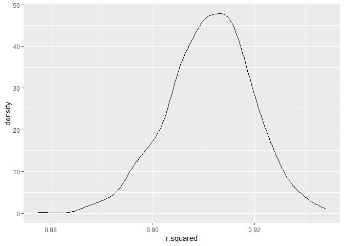
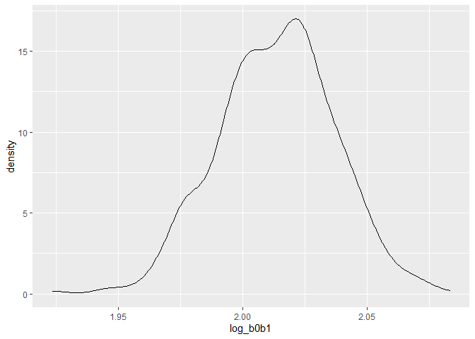
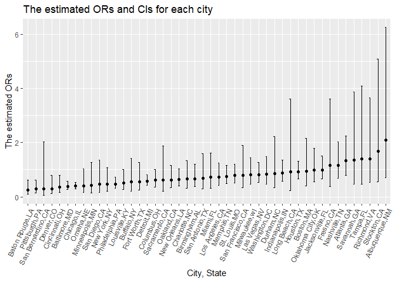
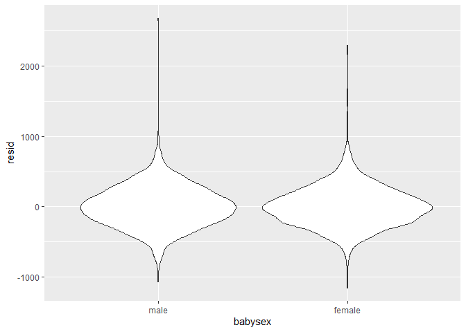
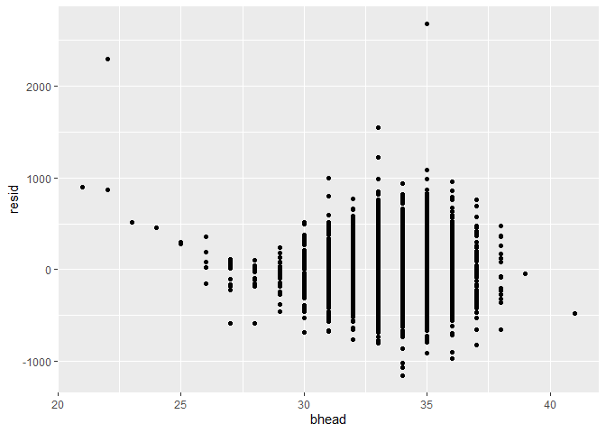
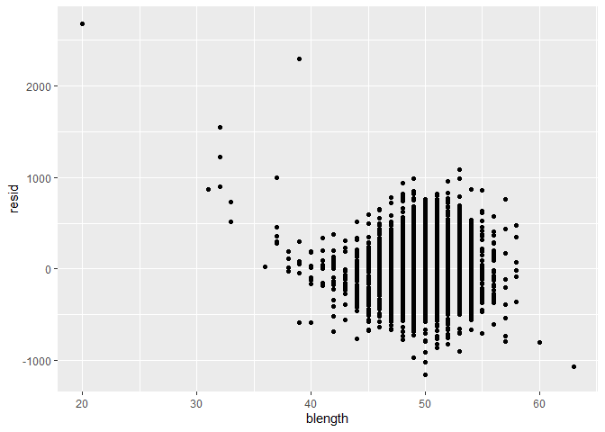
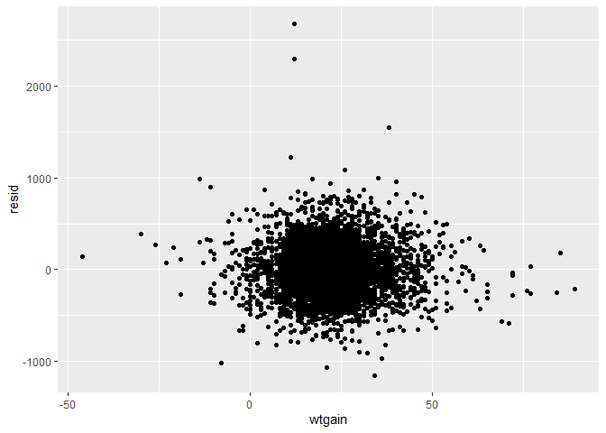
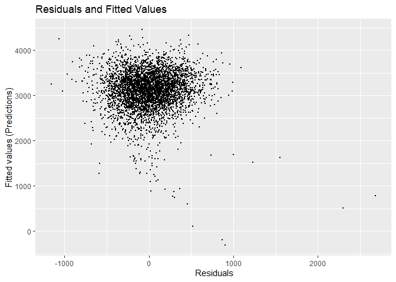
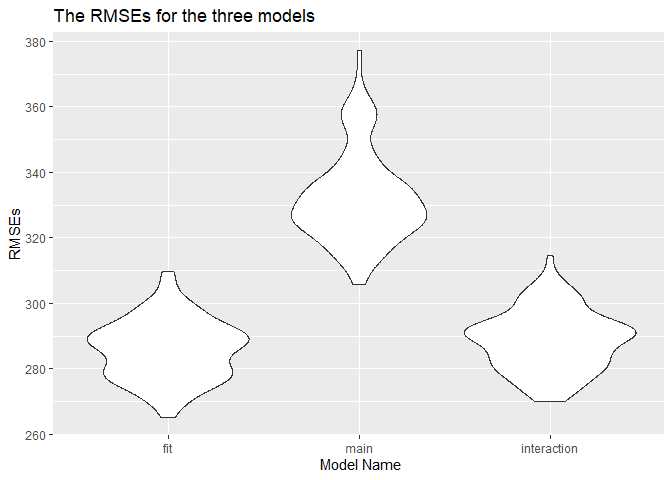

Homework 6
================
yh3429
2022-12-02

## Problem 1

``` r
library(tidyverse)
```

    ## ── Attaching packages ─────────────────────────────────────── tidyverse 1.3.2 ──
    ## ✔ ggplot2 3.3.6     ✔ purrr   0.3.4
    ## ✔ tibble  3.1.8     ✔ dplyr   1.0.9
    ## ✔ tidyr   1.2.0     ✔ stringr 1.4.1
    ## ✔ readr   2.1.2     ✔ forcats 0.5.2
    ## ── Conflicts ────────────────────────────────────────── tidyverse_conflicts() ──
    ## ✖ dplyr::filter() masks stats::filter()
    ## ✖ dplyr::lag()    masks stats::lag()

``` r
library(modelr)
```

To obtain a distribution for $\hat{r}^2$, we’ll follow basically the
same procedure we used for regression coefficients: draw bootstrap
samples; the a model to each; extract the value I’m concerned with; and
summarize. Here, we’ll use `modelr::bootstrap` to draw the samples and
`broom::glance` to produce `r.squared` values.

``` r
weather_df = 
  rnoaa::meteo_pull_monitors(
    c("USW00094728"),
    var = c("PRCP", "TMIN", "TMAX"), 
    date_min = "2017-01-01",
    date_max = "2017-12-31") %>%
  mutate(
    name = recode(id, USW00094728 = "CentralPark_NY"),
    tmin = tmin / 10,
    tmax = tmax / 10) %>%
  select(name, id, everything())
```

    ## Registered S3 method overwritten by 'hoardr':
    ##   method           from
    ##   print.cache_info httr

    ## using cached file: C:\Users\Owner\AppData\Local/Cache/R/noaa_ghcnd/USW00094728.dly

    ## date created (size, mb): 2022-09-29 10:33:10 (8.418)

    ## file min/max dates: 1869-01-01 / 2022-09-30

``` r
weather_df %>% 
  modelr::bootstrap(n = 1000) %>% 
  mutate(
    models = map(strap, ~lm(tmax ~ tmin, data = .x) ),
    results = map(models, broom::glance)) %>% 
  select(-strap, -models) %>% 
  unnest(results) %>% 
  ggplot(aes(x = r.squared)) + geom_density()
```

<!-- -->

In this example, the $\hat{r}^2$ value is high, and the upper bound at 1
may be a cause for the generally skewed shape of the distribution. If we
wanted to construct a confidence interval for $R^2$, we could take the
2.5% and 97.5% quantiles of the estimates across bootstrap samples.
However, because the shape isn’t symmetric, using the mean +/- 1.96
times the standard error probably wouldn’t work well.

We can produce a distribution for $\log(\beta_0 * \beta1)$ using a
similar approach, with a bit more wrangling before we make our plot.

``` r
weather_df %>% 
  modelr::bootstrap(n = 1000) %>% 
  mutate(
    models = map(strap, ~lm(tmax ~ tmin, data = .x) ),
    results = map(models, broom::tidy)) %>% 
  select(-strap, -models) %>% 
  unnest(results) %>% 
  select(id = `.id`, term, estimate) %>% 
  pivot_wider(
    names_from = term, 
    values_from = estimate) %>% 
  rename(beta0 = `(Intercept)`, beta1 = tmin) %>% 
  mutate(log_b0b1 = log(beta0 * beta1)) %>% 
  ggplot(aes(x = log_b0b1)) + geom_density()
```

<!-- -->

As with $r^2$, this distribution is somewhat skewed and has some
outliers.

The point of this is not to say you should always use the bootstrap –
it’s possible to establish “large sample” distributions for strange
parameters / values / summaries in a lot of cases, and those are great
to have. But it is helpful to know that there’s a way to do inference
even in tough cases.

## Problem 2

``` r
library (tidyverse)
library(ggplot2)
set.seed(1)
```

##### Read raw data

``` r
raw_df = read_csv("./data/homicide-data.csv") 
```

    ## Rows: 52179 Columns: 12
    ## ── Column specification ────────────────────────────────────────────────────────
    ## Delimiter: ","
    ## chr (9): uid, victim_last, victim_first, victim_race, victim_age, victim_sex...
    ## dbl (3): reported_date, lat, lon
    ## 
    ## ℹ Use `spec()` to retrieve the full column specification for this data.
    ## ℹ Specify the column types or set `show_col_types = FALSE` to quiet this message.

There are 52,179 observations and 12 variables in the raw dataset. And
the key variables include `city`, `state`, `dispostion`, and so on.

##### Data cleaning

``` r
homicide_df = raw_df %>%
  janitor::clean_names() %>%
  mutate (city_state = str_c (city, ",", state)) %>% 
  filter (city_state != "Dallas,TX" & city_state !="Phoenix,AZ"& 
          city_state != "Kansas City,MO"& city_state !="Tulsa,AL") %>%  
  filter (victim_race == c("White", "Black")) %>% 
  mutate (resolved = as.numeric(disposition == "Closed by arrest"),     
          victim_age = as.numeric(victim_age))
```

    ## Warning in victim_race == c("White", "Black"): longer object length is not a
    ## multiple of shorter object length

    ## Warning in mask$eval_all_mutate(quo): NAs introduced by coercion

``` r
homicide_df
```

    ## # A tibble: 19,802 × 14
    ##    uid   repor…¹ victi…² victi…³ victi…⁴ victi…⁵ victi…⁶ city  state   lat   lon
    ##    <chr>   <dbl> <chr>   <chr>   <chr>     <dbl> <chr>   <chr> <chr> <dbl> <dbl>
    ##  1 Alb-…  2.01e7 SATTER… VIVIANA White        15 Female  Albu… NM     35.1 -107.
    ##  2 Alb-…  2.01e7 MULA    VIVIAN  White        72 Female  Albu… NM     35.1 -107.
    ##  3 Alb-…  2.01e7 MARTIN… GUSTAVO White        56 Male    Albu… NM     35.1 -107.
    ##  4 Alb-…  2.01e7 BRITO   ELIZAB… White        22 Female  Albu… NM     35.1 -107.
    ##  5 Alb-…  2.01e7 BOYKIN  CEDRIC  Black        25 Male    Albu… NM     35.1 -107.
    ##  6 Alb-…  2.01e7 BARRAG… MIGUEL  White        20 Male    Albu… NM     35.1 -107.
    ##  7 Alb-…  2.01e7 WRONSKI VIOLA   White        88 Female  Albu… NM     35.1 -107.
    ##  8 Alb-…  2.01e7 TURNER  MICHEL… White        36 Female  Albu… NM     35.1 -107.
    ##  9 Alb-…  2.01e7 CHECKL… MICHAEL White        24 Male    Albu… NM     35.2 -107.
    ## 10 Alb-…  2.01e7 STOWE   KIMBREL White        50 Male    Albu… NM     35.1 -107.
    ## # … with 19,792 more rows, 3 more variables: disposition <chr>,
    ## #   city_state <chr>, resolved <dbl>, and abbreviated variable names
    ## #   ¹​reported_date, ²​victim_last, ³​victim_first, ⁴​victim_race, ⁵​victim_age,
    ## #   ⁶​victim_sex

##### For the city of Baltimore,MD

``` r
baltimore_df =
  homicide_df %>% filter (city_state == "Baltimore,MD") %>% 
  select(resolved, victim_age, victim_race, victim_sex)

fit_logi_balt = 
  baltimore_df %>% 
  glm(resolved ~ victim_age + victim_race + victim_sex, data = ., family = binomial()) 

logi_balt_tidy=  
fit_logi_balt %>% 
  broom::tidy() %>% 
  mutate(OR = exp(estimate),
         OR.conf.low = exp(estimate -1.96*std.error),
         OR.conf.high = exp(estimate +1.96*std.error)) %>%
  select(term, log_OR = estimate, OR, OR.conf.low, OR.conf.high ) %>% 
  filter (term == "victim_sexMale")

logi_balt_tidy 
```

    ## # A tibble: 1 × 5
    ##   term           log_OR    OR OR.conf.low OR.conf.high
    ##   <chr>           <dbl> <dbl>       <dbl>        <dbl>
    ## 1 victim_sexMale -0.940 0.391       0.266        0.573

So, we can get the adjusted odds ratio comparing male victims to female
victims is 0.391 (95% CI:0.266, 0.573), keeping all other variables
fixed.

##### For each of the cities

``` r
fit_logi_each =
   homicide_df %>% 
   select(city_state, resolved, victim_age, victim_race, victim_sex) %>% 
   nest (data = -city_state) %>% 
   mutate(models = map(data, ~glm(resolved ~ victim_age + victim_race + victim_sex, 
                                  data = .x, family = binomial())), 
          results = map(models, broom::tidy)) %>% 
  unnest(results) %>% 
   mutate(OR = exp(estimate),
         OR.conf.low = exp(estimate -1.96*std.error),
         OR.conf.high = exp(estimate +1.96*std.error)) %>%
  select(city_state, term, log_OR = estimate, OR, OR.conf.low, OR.conf.high ) %>% 
  filter (term == "victim_sexMale") 


  fit_logi_each 
```

    ## # A tibble: 47 × 6
    ##    city_state     term            log_OR    OR OR.conf.low OR.conf.high
    ##    <chr>          <chr>            <dbl> <dbl>       <dbl>        <dbl>
    ##  1 Albuquerque,NM victim_sexMale  0.736  2.09        0.698        6.25 
    ##  2 Atlanta,GA     victim_sexMale  0.296  1.34        0.802        2.25 
    ##  3 Baltimore,MD   victim_sexMale -0.940  0.391       0.266        0.573
    ##  4 Baton Rouge,LA victim_sexMale -1.37   0.253       0.103        0.621
    ##  5 Birmingham,AL  victim_sexMale -0.406  0.666       0.372        1.19 
    ##  6 Boston,MA      victim_sexMale -0.0684 0.934       0.402        2.17 
    ##  7 Buffalo,NY     victim_sexMale -0.601  0.548       0.213        1.41 
    ##  8 Charlotte,NC   victim_sexMale -0.425  0.654       0.322        1.33 
    ##  9 Chicago,IL     victim_sexMale -0.923  0.397       0.301        0.524
    ## 10 Cincinnati,OH  victim_sexMale -1.01   0.364       0.166        0.802
    ## # … with 37 more rows

##### Create a plot

``` r
each_city_pl =
   fit_logi_each %>%  
  mutate(city_state = fct_reorder(city_state, OR)) %>% 
  ggplot (aes(x=city_state, y=OR))+ geom_point()+
  geom_errorbar(aes(ymin=OR.conf.low, ymax=OR.conf.high), width=.2,
                 position=position_dodge(.05)) +
  labs(x = "City, State",
       y = "The estimated ORs",
       title = "The estimated ORs and CIs for each city") +
  theme(axis.text.x = element_text(angle = 65, hjust = 1))
  
each_city_pl
```

<!-- -->

Based on the plot, the smallest OR is Baton Rouge, LA and the largest OR
is Albuquerque, NM. And there are few cities with the relatively larger
confidence intervals, including Long Beach, Fresno, Savannah, Tampa,
Richmond, Stockton, and Albuquerque.

## Problem 3

##### Read raw data

``` r
raw_birthweight = read_csv("./data/birthweight.csv") 
```

    ## Rows: 4342 Columns: 20
    ## ── Column specification ────────────────────────────────────────────────────────
    ## Delimiter: ","
    ## dbl (20): babysex, bhead, blength, bwt, delwt, fincome, frace, gaweeks, malf...
    ## 
    ## ℹ Use `spec()` to retrieve the full column specification for this data.
    ## ℹ Specify the column types or set `show_col_types = FALSE` to quiet this message.

There are 4,342 observations and 20 variables in the raw dataset. And
the key variables include `babysex`, `bhead`, `bwt`, and so on.

##### Data Cleaning

``` r
birthweight_df = raw_birthweight %>% 
  janitor::clean_names() %>% drop_na() %>% 
  mutate (
    babysex = factor(babysex, levels = c(1,2), labels = c("male", "female")),
    frace = factor(frace, levels = c(1,2,3,4,8,9), labels = c("White","Black","Asian","Puerto Rican","Other","Unknown")),
    malform = factor(malform,levels = c(0,1),  labels = c("absent", "present")),
    mrace = factor(mrace, levels = c(1,2,3,4,8), labels = c("White","Black","Asian","Puerto Rican", "Other"))
  )
```

##### Propose a regression model for birthweight

``` r
fit_mod = lm(bwt ~ babysex + bhead + blength + wtgain, data = birthweight_df)

fit_mod %>%   broom::tidy()
```

    ## # A tibble: 5 × 5
    ##   term          estimate std.error statistic   p.value
    ##   <chr>            <dbl>     <dbl>     <dbl>     <dbl>
    ## 1 (Intercept)   -6022.      97.3      -61.9  0        
    ## 2 babysexfemale    41.1      8.80       4.67 3.05e-  6
    ## 3 bhead           146.       3.49      41.7  6.11e-320
    ## 4 blength          83.1      2.06      40.3  3.40e-302
    ## 5 wtgain            3.72     0.405      9.19 6.10e- 20

The model is based on the the related factors that underly birthweight.

##### Examining residuals and predictions

``` r
modelr::add_residuals(birthweight_df, fit_mod)
```

    ## # A tibble: 4,342 × 21
    ##    babysex bhead blength   bwt delwt fincome frace gaweeks malform menarche
    ##    <fct>   <dbl>   <dbl> <dbl> <dbl>   <dbl> <fct>   <dbl> <fct>      <dbl>
    ##  1 female     34      51  3629   177      35 White    39.9 absent        13
    ##  2 male       34      48  3062   156      65 Black    25.9 absent        14
    ##  3 female     36      50  3345   148      85 White    39.9 absent        12
    ##  4 male       34      52  3062   157      55 White    40   absent        14
    ##  5 female     34      52  3374   156       5 White    41.6 absent        13
    ##  6 male       33      52  3374   129      55 White    40.7 absent        12
    ##  7 female     33      46  2523   126      96 Black    40.3 absent        14
    ##  8 female     33      49  2778   140       5 White    37.4 absent        12
    ##  9 male       36      52  3515   146      85 White    40.3 absent        11
    ## 10 male       33      50  3459   169      75 Black    40.7 absent        12
    ## # … with 4,332 more rows, and 11 more variables: mheight <dbl>, momage <dbl>,
    ## #   mrace <fct>, parity <dbl>, pnumlbw <dbl>, pnumsga <dbl>, ppbmi <dbl>,
    ## #   ppwt <dbl>, smoken <dbl>, wtgain <dbl>, resid <dbl>

``` r
modelr::add_predictions(birthweight_df, fit_mod)
```

    ## # A tibble: 4,342 × 21
    ##    babysex bhead blength   bwt delwt fincome frace gaweeks malform menarche
    ##    <fct>   <dbl>   <dbl> <dbl> <dbl>   <dbl> <fct>   <dbl> <fct>      <dbl>
    ##  1 female     34      51  3629   177      35 White    39.9 absent        13
    ##  2 male       34      48  3062   156      65 Black    25.9 absent        14
    ##  3 female     36      50  3345   148      85 White    39.9 absent        12
    ##  4 male       34      52  3062   157      55 White    40   absent        14
    ##  5 female     34      52  3374   156       5 White    41.6 absent        13
    ##  6 male       33      52  3374   129      55 White    40.7 absent        12
    ##  7 female     33      46  2523   126      96 Black    40.3 absent        14
    ##  8 female     33      49  2778   140       5 White    37.4 absent        12
    ##  9 male       36      52  3515   146      85 White    40.3 absent        11
    ## 10 male       33      50  3459   169      75 Black    40.7 absent        12
    ## # … with 4,332 more rows, and 11 more variables: mheight <dbl>, momage <dbl>,
    ## #   mrace <fct>, parity <dbl>, pnumlbw <dbl>, pnumsga <dbl>, ppbmi <dbl>,
    ## #   ppwt <dbl>, smoken <dbl>, wtgain <dbl>, pred <dbl>

``` r
birthweight_df %>% 
  modelr::add_residuals(fit_mod) %>% 
  ggplot(aes(x = babysex, y = resid)) + geom_violin()
```

<!-- -->

``` r
birthweight_df %>% 
  modelr::add_residuals(fit_mod) %>% 
  ggplot(aes(x = bhead, y = resid)) + geom_point()
```

<!-- -->

``` r
birthweight_df %>% 
  modelr::add_residuals(fit_mod) %>% 
  ggplot(aes(x = blength, y = resid)) + geom_point()
```

<!-- -->

``` r
birthweight_df %>% 
  modelr::add_residuals(fit_mod) %>% 
  ggplot(aes(x = wtgain, y = resid)) + geom_point()
```

<!-- -->

##### Plot for model residuals and fitted values

``` r
birthweight_df %>% 
  add_predictions(fit_mod) %>% 
  add_residuals(fit_mod) %>% 
  ggplot(aes(x = resid, y = pred)) +
  geom_point(size=0.5) +
  labs(
    title = "Residuals and Fitted Values", 
    x = " Residuals", 
    y = "Fitted values (Predictions)")
```

<!-- -->

##### Compare with two other models

This comparison using in terms of the cross-validated prediction error

``` r
cv_df = 
  crossv_mc(birthweight_df, 100) 

cv_df =
  cv_df %>% 
  mutate(
    train = map(train, as_tibble),
    test = map(test, as_tibble))
```

``` r
cv_df = 
  cv_df %>% 
  mutate(
    fit_mod  = map(train, ~lm(bwt ~ babysex + bhead + blength + wtgain, data = .x)),
    main_mod  = map(train, ~lm(bwt ~ blength + gaweeks, data = .x)),
    interaction_mod  = map(train,  ~lm(bwt ~ babysex + bhead + blength  + babysex*bhead + babysex*blength + bhead*blength, data = .x))) %>% 
  mutate(
    rmse_fit = map2_dbl(fit_mod, test, ~rmse(model = .x, data = .y)),
    rmse_main = map2_dbl(main_mod, test, ~rmse(model = .x, data = .y)),
    rmse_interaction = map2_dbl(interaction_mod, test, ~rmse(model = .x, data = .y)))
```

``` r
cv_df %>% 
  select(starts_with("rmse")) %>% 
  pivot_longer(
    everything(),
    names_to = "model", 
    values_to = "rmse",
    names_prefix = "rmse_") %>% 
  mutate(model = fct_inorder(model)) %>% 
  ggplot(aes(x = model, y = rmse)) + geom_violin()+
  labs(
    title = "The RMSEs for the three models", 
    x = " Model Name", 
    y = "RMSEs")
```

<!-- -->

Based on these results, since the fit model and interaction model had
the relatively smaller root mean squared errors (RMSEs) than the main
model. It can justify the fit model and interaction model are better
than the main model. The fit model looks a little bit better than the
interaction model. But the difference between the fit model and
interaction model is not obvious. It still needs to further examine and
discuss, such as may need to balance goodness of fit and
interpretability.
